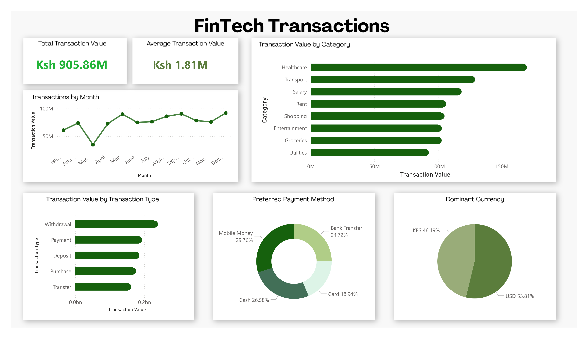

# FinTech Transactions Dashboard

A financial analytics dashboard built to monitor and dissect transaction activity across categories, payment methods, currencies, and transaction types — delivering a 360° view of digital financial behavior at scale.

## Project Overview
Financial institutions and FinTech platforms generate enormous volumes of transaction data daily. This project tackles the challenge of making that data meaningful — surfacing spending patterns, payment preferences, and currency trends that inform product decisions, risk monitoring, and customer segmentation strategies.

The core questions driving this dashboard:
- What categories are driving the highest transaction volumes?
- How do payment method preferences break down across the user base?
- What is the currency split between KES and USD, and what does that signal about the user demographic?
- Are transaction volumes stable or volatile across the year?

## Key Metrics
| Metric | Value |
|---|---|
| Total Transaction Value | Ksh 905.86M |
| Average Transaction Value | Ksh 1.81M |
| Total Categories Tracked | 8 |
| Payment Methods Analyzed | 4 |
| Currencies Monitored | 2 (KES & USD) |

---

## 📈Dashboard Features
### Transactions by Month
A time-series line chart tracking monthly transaction value across a full calendar year. The data reveals a **notable dip in March**, followed by a gradual recovery and relative stability from May through December — a pattern useful for forecasting and anomaly detection.

### Transaction Value by Category
Horizontal bar chart ranking 8 spending categories. **Healthcare dominates** with values exceeding Ksh 150M — more than any other category — followed by Transport and Salary. This ranking exposes where financial flows are most concentrated and where platform growth opportunities may exist.

### Transaction Value by Transaction Type
Breakdown across 5 transaction types: **Withdrawal, Payment, Deposit, Purchase, and Transfer**. Withdrawals lead, suggesting cash-out behavior is prevalent — a key signal for liquidity management and mobile money product design.

### Preferred Payment Method
A donut chart showing the split across four payment channels:
- **Mobile Money — 29.76%** (largest share)
- **Cash — 26.58%**
- **Bank Transfer — 24.72%**
- **Card — 18.94%**

The near-even distribution across methods highlights a market that hasn't fully consolidated around a single channel — an important insight for payment infrastructure investment decisions.

### Dominant Currency
A pie chart revealing that **USD accounts for 53.81%** of transaction value vs. **KES at 46.19%** — suggesting a significant cross-border or dollarized segment within the user base, with direct implications for FX risk and product localization.

---

## Tools & Technologies
- Microsoft Excel (Data Cleaning & Data Analysis)
- Power BI (Data Visualization)

---

## Insights & Business Takeaways
1. **Healthcare is the #1 spending category** at over Ksh 150M — in a market context, this could signal opportunities for health-focused financial products like insurance payment plans or medical credit lines.
2. **Mobile Money leads payment preferences** but only marginally over Cash and Bank Transfer — the platform serves a diverse user base that hasn't committed to one channel, making multi-rail payment support a necessity, not a luxury.
3. **USD dominance (53.81%)** in a KES market points to a significant diaspora or international business segment — relevant for FX pricing strategy and compliance considerations.
4. **Withdrawal as the top transaction type** suggests users are converting digital balances to cash, which is a characteristic behavior in emerging digital finance markets and affects liquidity planning.
5. **Stable monthly volumes (May–Dec)** after a Q1 dip suggest either a seasonal effect or a one-time disruption — worth investigating with cohort analysis as a follow-up.

